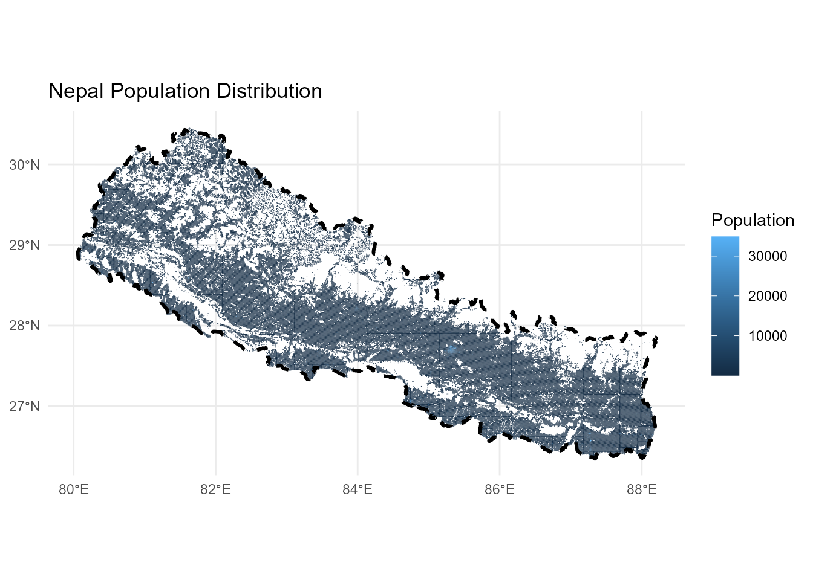

## 1 Project Overview

This analysis demonstrates advanced geospatial visualization techniques using R’s rayshader package to create a stunning 3D population density map of Nepal. The project showcases the integration of high-resolution population data with topographic visualization methods, resulting in an interactive and informative representation of demographic patterns across Nepal’s diverse terrain.

**Key Technologies**: R, rayshader, sf, stars, magick  
**Data Source**: Kontur Population Dataset (400m H3 hexagon resolution)  
**Projection**: ESRI:102306 (Nepal Nagarkot TM)

## 2 Environment Setup

### Package Installation and Loading

Package Installation (Run Once)

``` downlit
# Core packages for geospatial analysis
install.packages(c("tidyverse", "here", "sf", "tmap", "ggplot2", "mapview", "stars"))

# Visualization packages
install.packages(c("rayshader", "MetBrewer", "colorspace", "rayrender", "magick"))

# Font handling
install.packages("extrafont")
```

``` downlit
# Load required libraries
library(tidyverse)
library(here)
library(sf)
library(stars)
library(rayshader)
library(MetBrewer)
library(colorspace)
library(rayrender)
library(magick)
library(extrafont)
```

``` downlit
# Configure 3D rendering
options(rgl.useNULL = FALSE)

project_crs <- "EPSG:6207"
```

## 3 Data Acquisition and Loading

### Population Hexagon Data

The analysis utilizes high-resolution population data from Kontur, provided in H3 hexagonal grid format at 400-meter resolution. This dataset offers superior granularity compared to traditional administrative boundary-based population estimates.

``` downlit
# Load population data (H3 hexagons at 400m resolution)
nep_hex <- sf::st_read(
  paste0(
    "/vsigzip/",
    here::here("posts/nepal-population-density/data/kontur_population_NP_20220630.gpkg.gz")
  )
) |>
  sf::st_transform(project_crs)
```

    Reading layer `population' from data source 
      `/vsigzip/D:/GitHub/ar-puuk.github.io/posts/nepal-population-density/data/kontur_population_NP_20220630.gpkg.gz' 
      using driver `GPKG'
    Simple feature collection with 122809 features and 2 fields
    Geometry type: POLYGON
    Dimension:     XY
    Bounding box:  xmin: 8911286 ymin: 3041698 xmax: 9818046 ymax: 3562066
    Projected CRS: WGS 84 / Pseudo-Mercator

``` downlit
# Load administrative boundaries
nep_admin <- sf::st_read(
  paste0(
    "/vsigzip/",
    here::here("posts/nepal-population-density/data/kontur_boundaries_NP_20220407.gpkg.gz")
  )
) |>
  sf::st_transform(project_crs)
```

    Reading layer `sql_statement' from data source 
      `/vsigzip/D:/GitHub/ar-puuk.github.io/posts/nepal-population-density/data/kontur_boundaries_NP_20220407.gpkg.gz' 
      using driver `GPKG'
    Simple feature collection with 4902 features and 5 fields
    Geometry type: MULTIPOLYGON
    Dimension:     XY
    Bounding box:  xmin: 80.05862 ymin: 26.34776 xmax: 88.20153 ymax: 30.44694
    Geodetic CRS:  WGS 84

``` downlit
# Create unified Nepal boundary
nepal_boundary <- nep_admin |>
  sf::st_geometry() |>
  sf::st_union() |>
  sf::st_sf() |>
  sf::st_make_valid()
```

> **NOTE:**
>
> **Data Sources**:  
> - **Population Data**: [Kontur Population Dataset](https://data.humdata.org/dataset/kontur-population-nepal)  
> - **Administrative Boundaries**: [Kontur Boundaries Dataset](https://data.humdata.org/dataset/kontur-boundaries-nepal)  
> - **Coordinate Reference System**: EPSG:6207 for accurate representation of Nepal’s geography

## 4 Data Processing and Visualization Setup

### Initial Data Exploration

``` downlit
# Preliminary visualization to verify data quality
ggplot2::ggplot(nep_hex) +
  ggplot2::geom_sf(ggplot2::aes(fill = population), color = "gray66", linewidth = 0) +
  ggplot2::geom_sf(data = nepal_boundary, fill = NA, color = "black",
          linetype = "dashed", linewidth = 1) +
  ggplot2::theme_minimal() +
  ggplot2::labs(title = "Nepal Population Distribution",
       fill = "Population")
```



### Raster Conversion and Matrix Preparation

The conversion from vector hexagon data to raster format is essential for rayshader’s 3D rendering capabilities. This process involves calculating optimal dimensions while preserving the geographic aspect ratio.

``` downlit
# Calculate bounding box and aspect ratio
bbox <- sf::st_bbox(nepal_boundary)

# Define corner points for aspect ratio calculation
bottom_left <- sf::st_point(c(bbox[["xmin"]], bbox[["ymin"]])) |>
  sf::st_sfc(crs = project_crs)
bottom_right <- sf::st_point(c(bbox[["xmax"]], bbox[["ymin"]])) |>
  sf::st_sfc(crs = project_crs)
top_left <- sf::st_point(c(bbox[["xmin"]], bbox[["ymax"]])) |>
  sf::st_sfc(crs = project_crs)

# Calculate dimensions
width <- sf::st_distance(bottom_left, bottom_right)
height <- sf::st_distance(bottom_left, top_left)

# Determine aspect ratios
if(width > height) {
  w_ratio <- 1
  h_ratio <- height / width
} else {
  h_ratio <- 1
  w_ratio <- width / height
}

# Convert to raster with optimal resolution
size <- 1000 * 2.5

pop_raster <- stars::st_rasterize(nep_hex,
                          nx = floor(size * w_ratio),
                          ny = floor(size * h_ratio))

# Create matrix for 3D rendering
pop_matrix <- matrix(pop_raster$population,
                    nrow = floor(size * w_ratio),
                    ncol = floor(size * h_ratio))
```

## 5 Color Scheme Development

### MetBrewer Color Palette Selection

The visualization employs the “OKeeffe2” palette from MetBrewer, chosen for its warm earth tones that effectively represent population density while maintaining visual appeal and accessibility.

``` downlit
# Generate color palette
color <- MetBrewer::met.brewer("OKeeffe2")

# Create texture gradient with bias toward higher values
texture <- grDevices::colorRampPalette(color, bias = 3)(256)

# Preview color scheme
colorspace::swatchplot(texture)
```


## 6 3D Visualization Rendering

### Interactive 3D Display

``` downlit
# Close any existing RGL windows
rgl::close3d()

# Generate 3D visualization
pop_matrix |>
  rayshader::height_shade(texture = texture) |>
  rayshader::plot_3d(
    heightmap = pop_matrix,
    zscale = 250 / 2.5,
    solid = FALSE,
    shadowdepth = 0
  )

# Set optimal camera position
rayshader::render_camera(
  theta = 0,
  phi = 30,
  zoom = 0.4,
  fov = 90
)
```

### High-Quality Rendering

The final rendering process utilizes rayshader’s advanced lighting system to create publication-ready visualizations with professional-grade quality and resolution.

``` downlit
outfile <- here::here("posts/nepal-population-density/plots/final_plot.png")

# Render high-quality image with timing
{
  start_time <- Sys.time()
  cat(crayon::cyan("Rendering started:", start_time), "\n")

  # Ensure output directory exists
  if(!file.exists(outfile)) {
    png::writePNG(matrix(1), target = outfile)
  }

  rayshader::render_highquality(
    filename = outfile,
    interactive = FALSE,
    lightdirection = 225,
    lightaltitude = c(20, 80),
    lightcolor = c(color[2], "white"),
    lightintensity = c(600, 100),
    width = 1980,
    height = 1080,
    samples = 300
  )

  end_time <- Sys.time()
  diff <- end_time - start_time
  cat(crayon::cyan("Rendering completed in:", diff), "\n")
}
```

    Rendering started: 2025-08-31 10:04:56.995696 

    Rendering completed in: 5.36727086702983 

## 7 Post-Processing and Annotation

### Geographic Labeling

The final step enhances the visualization with strategic city labels and professional annotation using the {magick} package for image manipulation.

``` downlit
# Load rendered image
pop_raster <- magick::image_read(
  here::here("posts/nepal-population-density/plots/final_plot.png")
)

# Define text styling
text_color <- colorspace::darken(color[7], .5)
colorspace::swatchplot(text_color)
```


``` downlit
# Import and load fonts
extrafont::font_import(
  paths = here::here("posts/nepal-population-density/font"), prompt = FALSE
)

extrafont::loadfonts(quiet = TRUE)
```

``` downlit
# Add comprehensive annotations
pop_raster |>
  # magick::image_crop(gravity = "center", geometry = "") |> 
  magick::image_annotate("NEPAL",
                 gravity = "northeast",
                 location = "+50+50",
                 color = text_color,
                 size = 150,
                 # degrees = 0,
                 font = "Ananda Namaste",
                 weight = 700) |>
  magick::image_annotate("POPULATION DENSITY MAP",
                 gravity = "northeast",
                 location = "+50+200",
                 color = text_color,
                 size = 36.5,
                 # degrees = 0,
                 font = "FuturaBT-Medium",
                 weight = 500) |>
  # Major urban centers
  magick::image_annotate("Kathmandu",
                 gravity = "center",
                 location = "+250-50",
                 color = scales::alpha(text_color, .8),
                 size = 30,
                 # degrees = -85,
                 font = "FuturaBT-Medium") |>
  magick::image_annotate("Pokhara",
                 gravity = "center",
                 location = "-30+35",
                 color = scales::alpha(text_color, .8),
                 size = 25,
                 # degrees = -75,
                 font = "FuturaBT-Medium") |>
  magick::image_annotate("Biratnagar",
                 gravity = "east",
                 location = "+125+100",
                 color = scales::alpha(text_color, .8),
                 size = 28,
                 # degrees = -75,
                 font = "FuturaBT-Medium") |>
  # Regional centers
  magick::image_annotate("Birgunj",
                 gravity = "center",
                 location = "+130+100",
                 color = scales::alpha(text_color, .8),
                 size = 25,
                 font = "FuturaBT-Medium") |>
  magick::image_annotate("Nepalgunj",
                 gravity = "center",
                 location = "-450+0",
                 color = scales::alpha(text_color, .8),
                 size = 24,
                 font = "FuturaBT-Medium") |>
  magick::image_annotate("Janakpur",
                 gravity = "east",
                 location = "+500+140",
                 color = scales::alpha(text_color, .8),
                 size = 22,
                 font = "FuturaBT-Medium") |>
  # Additional urban areas
  magick::image_annotate("Itahari",
                 gravity = "east",
                 location = "+230+150",
                 color = scales::alpha(text_color, .8),
                 size = 24,
                 # degrees = -75,
                 font = "FuturaBT-Medium") |> 
  magick::image_annotate("Surkhet",
                 gravity = "center",
                 location = "-450-75",
                 color = scales::alpha(text_color, .8),
                 size = 20,
                 # degrees = -75,
                 font = "FuturaBT-Medium") |> 
  magick::image_annotate("Tikapur",
                 gravity = "west",
                 location = "+400-125",
                 color = scales::alpha(text_color, .8),
                 size = 22,
                 # degrees = -75,
                 font = "FuturaBT-Medium") |> 
  magick::image_annotate("Dhangadhi",
                 gravity = "west",
                 location = "+275-135",
                 color = scales::alpha(text_color, .8),
                 size = 18,
                 # degrees = -75,
                 font = "FuturaBT-Medium") |> 
  magick::image_annotate("Bharatpur",
                 gravity = "center",
                 location = "+60+0",
                 color = scales::alpha(text_color, .8),
                 size = 20,
                 # degrees = -75,
                 font = "FuturaBT-Medium") |> 
  magick::image_annotate("Butwal",
                 gravity = "center",
                 location = "-125+5",
                 color = scales::alpha(text_color, .8),
                 size = 20,
                 # degrees = -75,
                 font = "FuturaBT-Medium") |>
  magick::image_annotate("Ghorahi\nTulsipur",
                 gravity = "center",
                 location = "-350-100",
                 color = scales::alpha(text_color, .8),
                 size = 22,
                 # degrees = -75,
                 font = "FuturaBT-Medium") |> 
  # Professional attribution
  magick::image_annotate("Visualization by: Pukar Bhandari with Rayshader(@tylermorganwall) | Data: Kontur Population (Released 2022-06-30)",
                 gravity = "southwest",
                 location = "+20+20",
                 color = scales::alpha(text_color, .6),
                 # degrees = 0,
                 font = "FuturaBT-Medium",
                 size = 20) |>
  magick::image_write(
    here::here("posts/nepal-population-density/nepal_population_density.png"),
    format = "png",
    quality = 100
  )
```

[](nepal_population_density.png "Population Density of Nepal")

Population Density of Nepal

## 8 Technical Methodology

### Spatial Data Processing Pipeline

1.  **Data Transformation**: Vector hexagon data converted to standardized coordinate reference system (Nepal Nagarkot TM - ESRI:102306)
2.  **Rasterization**: Optimal grid resolution calculated to balance detail with computational efficiency
3.  **Matrix Conversion**: Raster data transformed into height matrix for 3D rendering
4.  **Texture Mapping**: Population values mapped to color gradients using perceptually uniform color spaces

### Rendering Specifications

- **Resolution**: 1980×1080 pixels for high-definition output
- **Sampling**: 300 samples for anti-aliasing and smooth gradients
- **Lighting**: Dual-source lighting system (directional + ambient)
- **Z-Scale**: Optimized vertical exaggeration (250/2.5) for clear population peaks

## 9 Results and Applications

This methodology produces publication-quality 3D population density visualizations suitable for:

- **Urban Planning**: Identifying population clusters and growth patterns
- **Infrastructure Development**: Targeting high-density areas for transportation networks
- **Emergency Response**: Understanding population distribution for resource allocation
- **Academic Research**: Visual communication of demographic data

## 10 Conclusion

This workflow demonstrates the power of combining modern R packages for geospatial analysis with advanced 3D visualization techniques. The resulting maps provide intuitive understanding of Nepal’s population distribution patterns, highlighting the concentration of people in the Terai region and major urban centers while showcasing the relatively sparse population in mountainous areas.

The methodology is transferable to other geographic contexts and can be adapted for various demographic or infrastructure planning applications in transportation and urban development projects.

------------------------------------------------------------------------

*Want to contribute or suggest improvements? Visit the project repository at:* <https://github.com/ar-puuk/Population-Density-Maps>

## Citation

BibTeX citation:

``` quarto-appendix-bibtex
@online{bhandari2023,
  author = {Bhandari, Pukar},
  title = {3D {Population} {Density} {Mapping} of {Nepal}},
  date = {2023-01-03},
  url = {https://ar-puuk.github.io/posts/nepal-population-density/},
  langid = {en}
}
```

For attribution, please cite this work as:

Bhandari, Pukar. 2023. “3D Population Density Mapping of Nepal.” January 3. <https://ar-puuk.github.io/posts/nepal-population-density/>.
