### [ActivitySim Accessibility](slides/activitysim-accessibility/index.llms.md)

[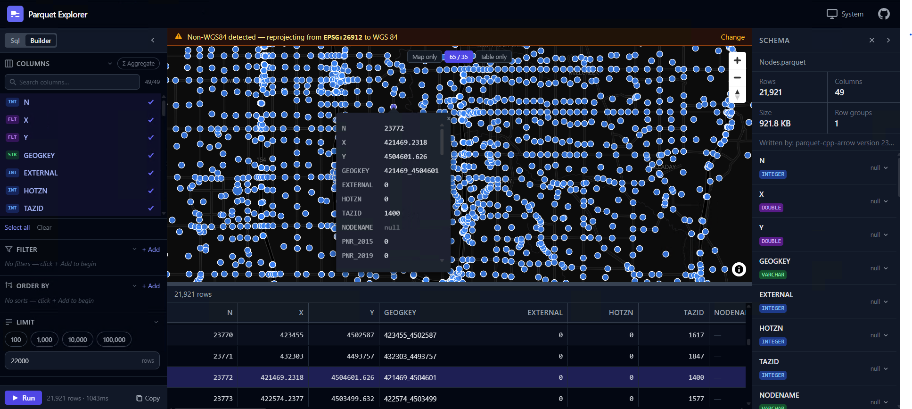](posts/parquet-explorer/index.llms.md)

### [Building a Client-Side Geo/Parquet File Viewer](posts/parquet-explorer/index.llms.md)

[Built on webassembly, works in browser, and data never leaves your computer](posts/parquet-explorer/index.llms.md)

Apr 12, 2026

Pukar Bhandari

[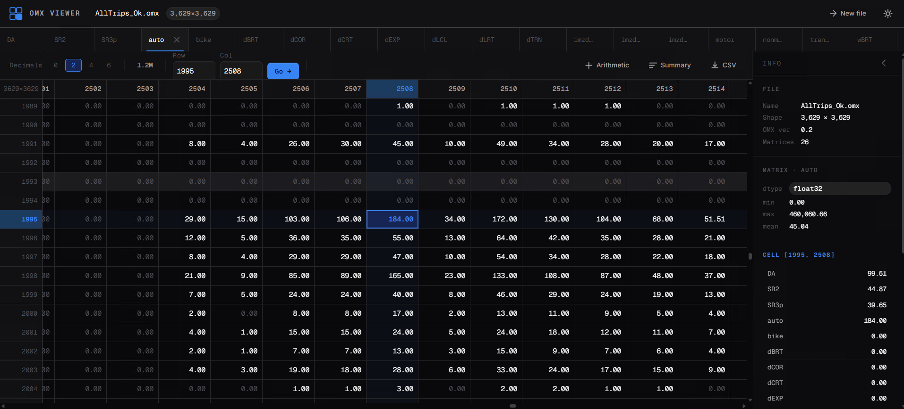](posts/omx-viewer/index.llms.md)

### [Building a Client-Side Open Matrix (OMX) File Viewer](posts/omx-viewer/index.llms.md)

[Built on webassembly, works in browser, and data never leaves your computer](posts/omx-viewer/index.llms.md)

Apr 11, 2026

Pukar Bhandari

[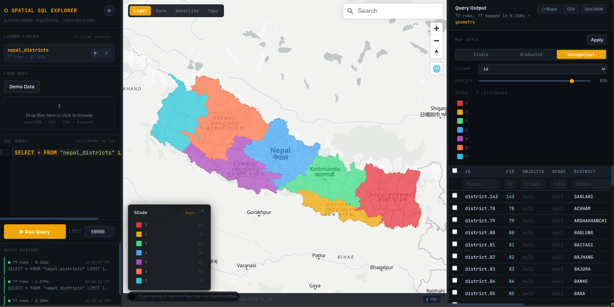](posts/spatial-sql-exporer/index.llms.md)

### [Building a Client-Side Spatial SQL Explorer](posts/spatial-sql-exporer/index.llms.md)

[DuckDB-WASM, MapLibre GL, and CodeMirror 6 — all in the browser](posts/spatial-sql-exporer/index.llms.md)

Feb 25, 2026

Pukar Bhandari

[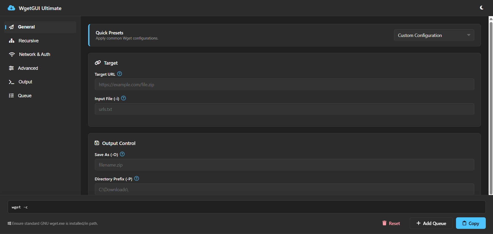](posts/wget-gui/index.llms.md)

### [WgetGUI Ultimate: A Fluent Command Generator](posts/wget-gui/index.llms.md)

A modern, Windows 11-inspired web interface for building complex GNU Wget commands

Jan 25, 2026

Pukar Bhandari

[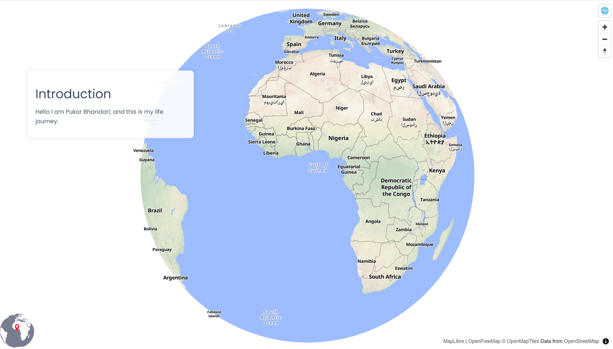](posts/storymap_my_journey/index.llms.md)

### [Building an Interactive Storymap using {mapgl}](posts/storymap_my_journey/index.llms.md)

[A Visual Journey Through My Life.](posts/storymap_my_journey/index.llms.md)

Creating an open-source, interactive storymap with the {mapgl} R package to visualize my journey across the world.

Sep 3, 2025

Pukar Bhandari

[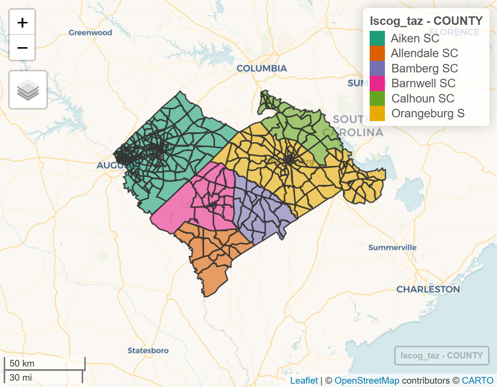](posts/socioeconomic-demo/index.llms.md)

### [Base Year SE Data Development](posts/socioeconomic-demo/index.llms.md)

[Lower Savannah Council of Governments (LSCOG) 2050 Long Range Transportation Plan](posts/socioeconomic-demo/index.llms.md)

Jul 5, 2025

Pukar Bhandari

[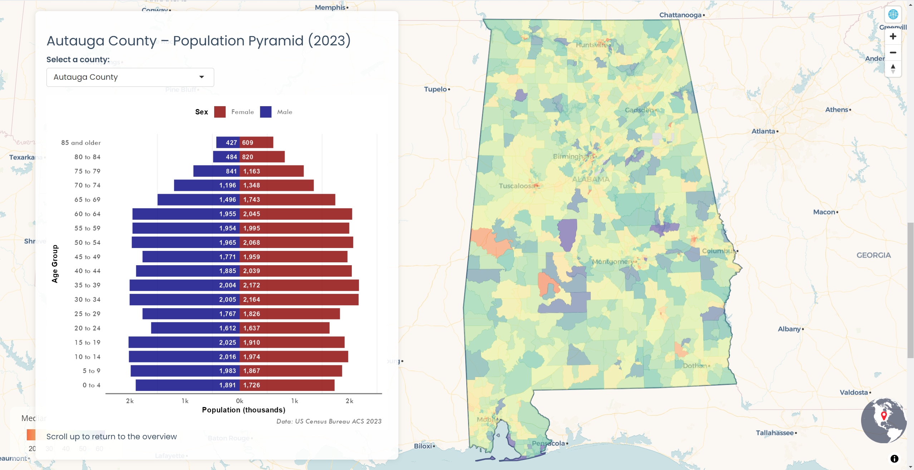](posts/population-pyramid-explorer/index.llms.md)

### [Building an Interactive Population Pyramid Explorer](posts/population-pyramid-explorer/index.llms.md)

[Exploring demographic patterns across US counties through interactive visualization using {R-Shiny} and {mapgl}](posts/population-pyramid-explorer/index.llms.md)

A deep dive into creating a story-driven Shiny application that combines interactive mapping with demographic visualizations using Census data.

Jun 25, 2025

Pukar Bhandari

[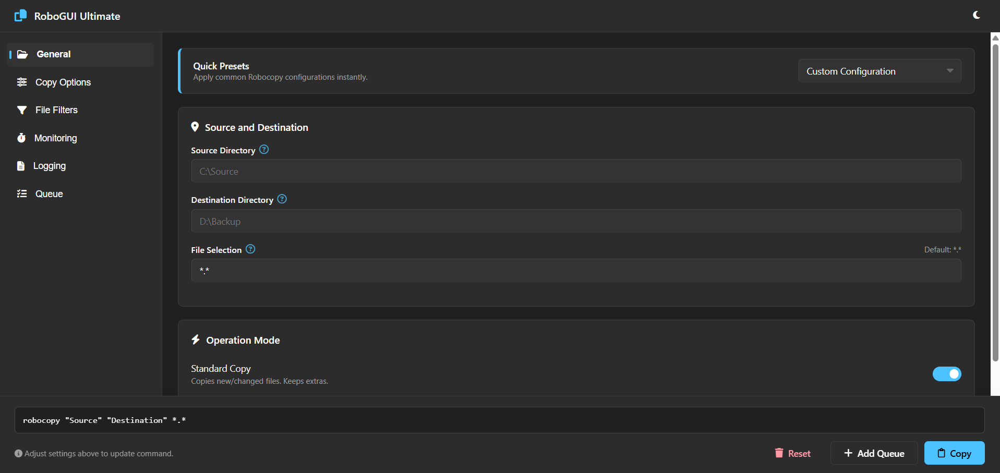](posts/robocopy-gui/index.llms.md)

### [Interactive Robocopy GUI Tool](posts/robocopy-gui/index.llms.md)

A web-based interface for generating Windows robocopy commands with ease

Jun 15, 2025

Pukar Bhandari

[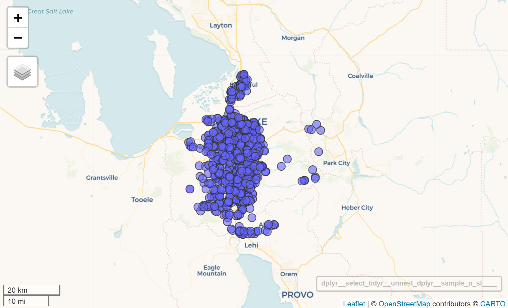](posts/overture-data-download/index.llms.md)

### [Overture Maps Data Download](posts/overture-data-download/index.llms.md)

[Applying DuckDB in R and Python](posts/overture-data-download/index.llms.md)

May 22, 2024

Pukar Bhandari

[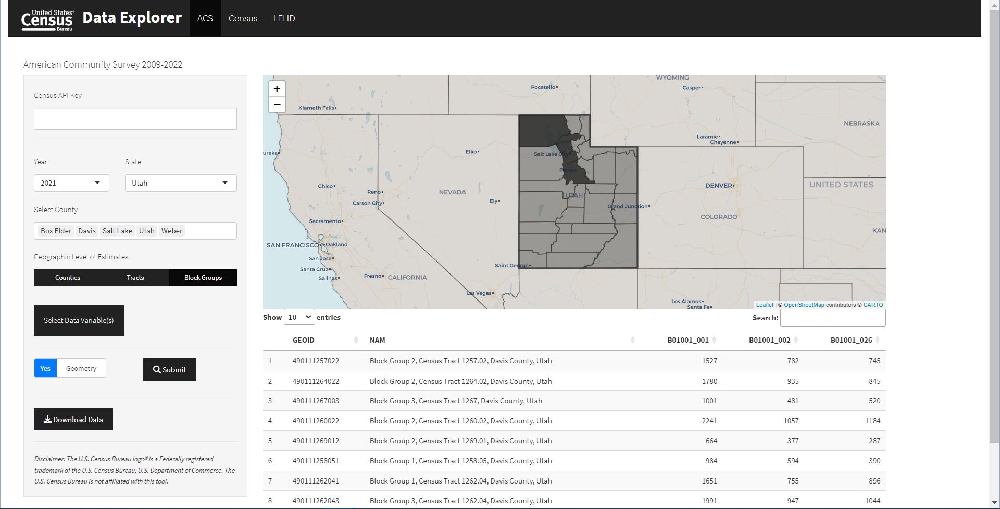](posts/uscensus-dashboard/index.llms.md)

### [Building a U.S. Census Data Explorer](posts/uscensus-dashboard/index.llms.md)

[A Shiny Dashboard for ACS, Decennial Census, and LEHD Data](posts/uscensus-dashboard/index.llms.md)

Learn how to build an interactive Shiny dashboard for exploring U.S. Census data including ACS, Decennial Census, and LEHD datasets with integrated mapping capabilities.

May 11, 2024

Pukar Bhandari

[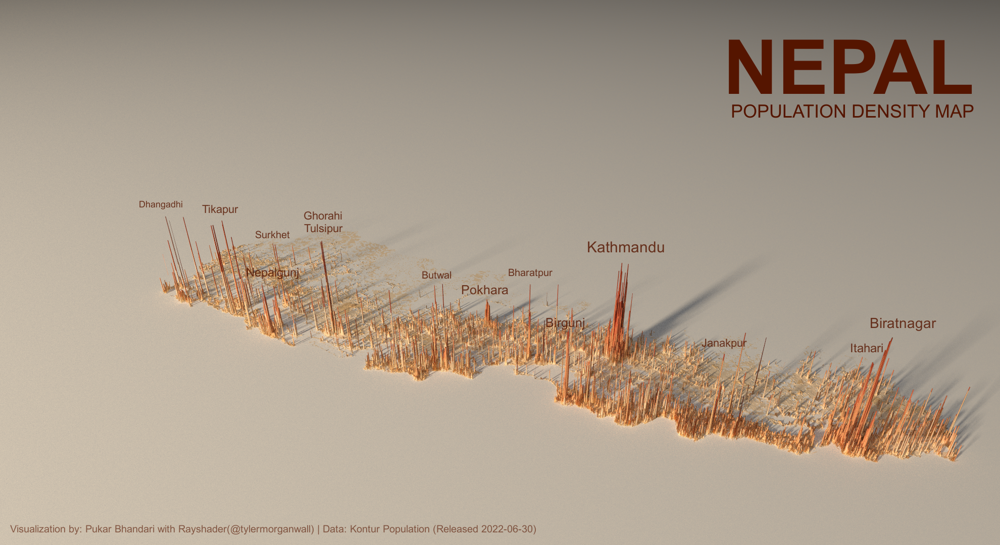](posts/nepal-population-density/index.llms.md)

### [3D Population Density Mapping of Nepal](posts/nepal-population-density/index.llms.md)

[Using Rayshader for Advanced Geospatial Visualization](posts/nepal-population-density/index.llms.md)

Jan 3, 2023

Pukar Bhandari
